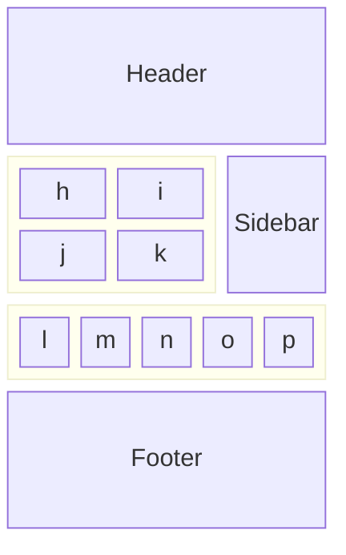
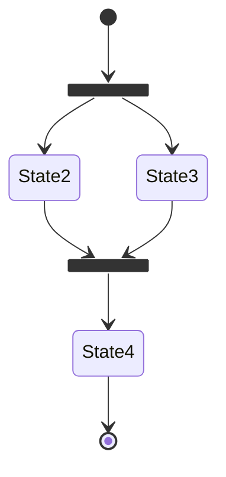
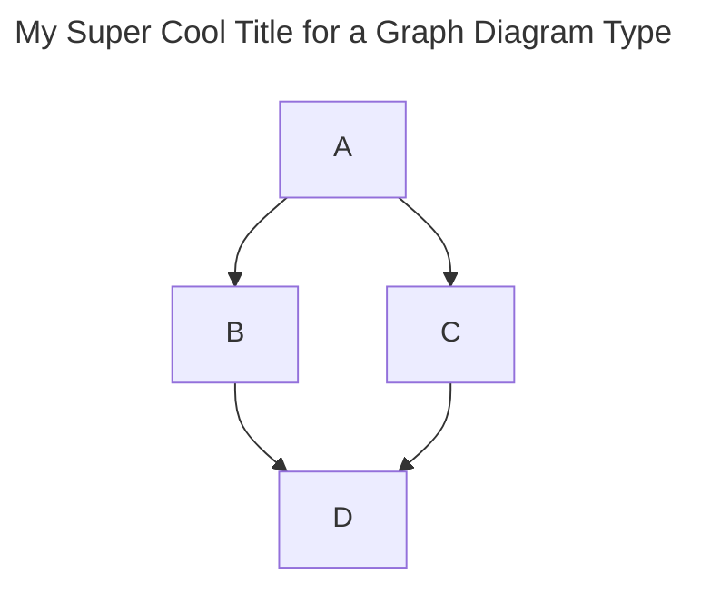

# New website based on MkDocs

Hi there! You are reading this on my website created with a application called [MkDocs](https://www.mkdocs.org/). My previous much prettier website was based on [Astro](https://astro.build), which is great for content rich websites like this personal blog but I found that when upgrading components it resulted in a broken websites. MkDocs is is less cutting edge and more stable.
<!-- more -->

## Mkdocs Background

MkDocs is a good application for a personal blog site because:

  * **Stability**: MkDocs is less cutting-edge than some alternatives, making it more stable and reliable for long-term content management.
  * **Simplicity**: It uses Markdown for content, which is easy to write and maintain.
  * **Content Focus**: MkDocs is designed for content-rich websites, making it ideal for blogs and documentation.
  * **Easy Version Control**: Markdown files work well with version control systems, allowing you to track changes and collaborate easily.
  * **Automatic Builds**: MkDocs supports automated workflows for building and publishing your site, so you can focus on writing.
  * **Open Source**: It’s free, customizable, and supported by a helpful community.
  * **Good Navigation and Search**: MkDocs provides built-in navigation and search features, improving the reader’s experience.

## Content written in Markup

Web pages are typically structured as HTML, which is a text markup format that is great for web browsers, but somewhat more difficult for humans to use. Consequently MKDocs also enables one to write content in Markdown. Markdown is a markup language that has gained popularity among writers, developers, and content creators.  Markdown simplifies web content formatting, making it accessible and portable.

 1. Markdown simplifies formatting by providing an easy-to-use syntax. It’s suitable for creating websites, notes, presentations, documentation, and more.
 2. Markdown files can be opened in any text editor on any operating system.
 3. Markdown’s simplicity ensures that your content remains accessible even as technology evolves.

## Enhancements

An open source source tool MkDocs has an ecosystem of add-ons. Here are a few that can enhance the website:

### Mermaid Diagrams

Mermaid Diagrams are diagrams generated from plain text using the Mermaid syntax. Mermaid lets you create flowcharts, sequence diagrams, Gantt charts, and more directly in Markdown files. This makes it easy to include and **version-control** diagrams as text, and they are rendered as SVG images in your site. This also makes sure that the page is smaller than they would be is included as an image.

The Material theme for MkDocs will automatically initialize the JavaScript runtime when a page includes a `mermaid` code block.

No further configuration is necessary. The advantages over a custom integration are:

 * Diagrams automatically use fonts and colors defined in `mkdocs.yml`[^1]
 * Fonts and colors can be customized with [additional style sheets]
 * Support for both, light and dark color schemes – _try it on this page!_

  [^1]:
    While all Mermaid.js features should work out-of-the-box, Material for
    MkDocs will currently only adjust the fonts and colors for flowcharts,
    sequence diagrams, class diagrams, state diagrams and entity relationship
    diagrams. See the section on other diagrams for more information why this
    is currently not implemented for all diagrams.


<div class="result" markdown>

<\div>

````md

````



</div>

````md

````
Becomes


#### Captions

MkDocs Extensions can use used to extend gaps in Markdown syntax. Here we can ensure that auto numbered captions can be applied to Tables, Lists and Figures.

Here is a regular list without the prefix.

  * item one
  * item two
  * item three

You can prefix a table, list, or figure with a caption and optionally including

 - unique id
 - style setting to align list left or right. Default is centered

<!--
The following HTML is required because we have caption plugin that processes codeblocks as well as the markdown.
This way we can let reader know how to implement a caption.
-->
For example:

<div>
    List&#58; This is a list caption &#123; #my-list  style="display: block; margin-left: 0; margin-right: auto;"&#125;
</div>

And this is what is produced:

List: This is a list caption {#my-list style="display: block; margin-left: 0; margin-right: auto;"}

  * item one
  * item two
  * item three

See [](#my-list) for more details.


#### Figure Sizing

HTML should specify the size and positioning of image.

````md

{height=200px width=200px}
````

{height=200px width=200px}


### Version Control

When content is written in simple text documents we can use same tools used by code developers to manage multiple versions. Version control of the content offers several benefits:

 * History and Revisions: Version control allows the author to track changes over time. You can review previous versions, compare changes, and revert to an earlier state if needed.
 * Backup and Safety: By using version control, your work is backed up in a repository. If your local copy is lost or corrupted, you can retrieve it from the repository.
 * Experimentation: Version control encourages experimentation. You can create branches to try out different ideas without affecting the main document.
 * Collaboration: Even as a single author, you might collaborate with others in the future. Version control prepares you for that possibility by providing a structured way to manage changes.

### Automated Builds

An automated workflow has been setup to automatically run when content changes are uploaded to the version control repository. This means that the author can focus on creating content not on the publication process which is now automatic.

## Open source

The benefits of this are:

 * Rapid Innovation: The collaborative nature of open source development fosters innovation. Communities contribute enhancements, features, and improvements at a faster pace.
 * Community Support: Open source communities offer forums, documentation, and support. Developers can share knowledge and collaborate with peers across organizations.
 * Flexibility and Customization: Open source software allows customization to fit specific needs. Developers can modify and extend the codebase, tailoring it to their requirements.
 * Cost Efficiency: Open source software is often free to use, and even when there’s a licensing fee, it’s typically much lower than proprietary alternatives.

## Community

The opensource development process has also resulted in a community. This community contribute help via the code repository.

### Pre-configured Themes

Since MkDocs can be configured to transform content in dozens of ways it is useful to start designing a website from a pre-configured theme.

This website is based on a theme called [Material](https://squidfunk.github.io/mkdocs-material/). It is a minimal multi-author Astro blog theme that is perfect for any kind of blog website.


#### Performance

MkDocs produces static files that can be uploaded to your webserver and does not require a program to generate them at request time. This results in a faster website improving the experience for users.

[https://pagespeed.web.dev/](https://pagespeed.web.dev/) is a great tool that one can use to check how fast a page is on the internet.


#### MkDocs Material Theme features

Some of the important features of the Material theme are:

 * Searchability: Documentation is instantly searchable with zero effort
 * Annotations: An easy way to attach arbitrary content to specific sections of code blocks by adding numeric markers in code blocks and inline comments in the language of the code block.
 * Social cards: Social media posts engagement is increased when using preview images. The Material theme automatically generates social cards.
 * Blog Post with social share options so that users can quickly share blog post with their networks.
 * Tags and categories support for blog content so that similar content can be found quickly


#### Image optimization

An area that MkDocs still needs work in is in the automatic generation of performant image sizes and formats. Astro has built in support for lazy loading and multiple sizes. Its likely to take a few years before this is dealt with. Its on the [MkDocs Material Theme Backlog](https://github.com/users/squidfunk/projects/4).

#### SVG images

In addition to the automatically generated Mermaid diagrams, Astro, can also display SVG diagrams as the following markdown snippet shows.

````md


or


````


<figcaption>The is displayed as an Inline SVG. See image name ends with inline.svg</figcaption>

The benefit of this is that ability to embed arbitrarily complex custom-made images.

#### Search Engine Optimization (SEO)

Getting SEO settings right for content websites used to be difficult.
By using content meta data and the standard templates makes it possible to generate information and embed it into generated pages required by many of the major SEO standards.

MkDocs also comes with a Sitemap and RSS feed generators. A Sitemap is an XML file that outlines all of the pages and files on your site. Search engines like Google read this file to crawl your site more efficiently.

### Tags and Categories

Content can be labeled with categories and tags.  This enables me to group similar topics together.

### YouTube

Adding links to Youtube videos is a common requirement. Here

```
<div class="video-wrapper">
  <iframe width="1280" height="720" src="https://www.youtube.com/embed/x_x-JAAKSvU" frameborder="0" allowfullscreen></iframe>
</div>
<figcaption>Youtube 1: Google I/O 2025 Opening Film </figcaption>
```

<div class="video-wrapper">
  <iframe width="1280" height="720" src="https://www.youtube.com/embed/x_x-JAAKSvU" frameborder="0" allowfullscreen></iframe>
</div>
<figcaption>Youtube 1: Google I/O 2025 Opening Film </figcaption>

## Admonitions or callouts

Admonitions, also known as call-outs, are an excellent for including side content without significantly interrupting the document flow. Material theme for MkDocs provides several different types of admonitions and allows for the inclusion and nesting of arbitrary content.

!!! note "Phasellus posuere in sem ut cursus"

    Lorem ipsum dolor sit amet, consectetur adipiscing elit. Nulla et euismod
    nulla. Curabitur feugiat, tortor non consequat finibus, justo purus auctor
    massa, nec semper lorem quam in massa.

Callout [types](https://squidfunk.github.io/mkdocs-material/reference/admonitions/#classic-admonitions-docsstylesheetsextracss)

 * note
 * abstract
 * info
 * tip
 * success
 * warning
 * danger
 * question
 * failure
 * bug
 * example
 * important

## Conclusion

MkDocs is a big player in the software development community. It is an extensible markdown based static site generator.