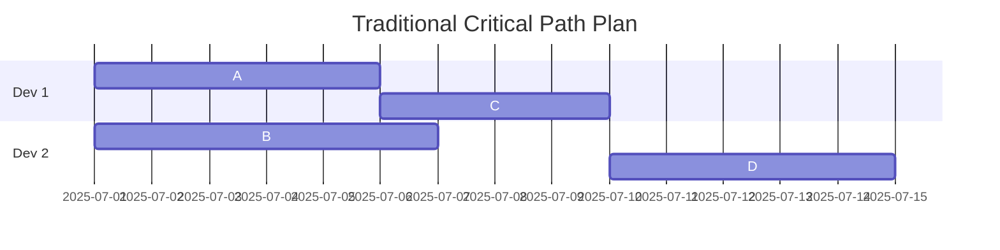
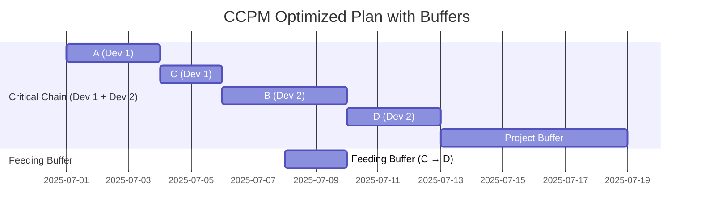

# Critical Chain Project Management CCPM

CCPM is the Theory of Constraints’ answer to why so many projects end up late, over budget, or half-baked.
At its core, CCPM rethinks how time is managed, focusing on what really limits a project's throughput.

Traditional project management pads each task with safety margins, but that creates hidden inefficiencies. CCPM flips that logic:

- Build projects around constraints, not just task sequences
- Buffer at the project level, not per task
- Minimize multitasking and keep work flowing on the critical chain (not just the critical path)

## Key Elements

1. **Critical Chain:** The longest path of dependent tasks + resource dependencies. It’s the actual constraint for project completion.
2. **Buffers:**
    - **Project Buffer** protects delivery date
    - **Feeding Buffers** protect the chain from delays in non-critical paths

    Just like insurance pools risk, buffers in CCPM pool uncertainty and variation. Instead of padding every single task (which can create inefficiencies and Parkinson’s Law-style delays), project-level buffers act as a shared safety net:

    Car insurance protects you if one unpredictable event—like an accident—throws off your finances.

    CCPM project buffers protect the entire project timeline if any task slips or hits an unforeseen snag.

    And just like you'd rather have one comprehensive insurance policy than try to predict and protect against every possible small event, CCPM says: stop trying to guess every hiccup in every task—buffer smarter, not harder.

    This mindset really rewards the systems thinker in you.

    How Buffer Size Is Determined?

        In CCPM, buffer size often comes from something like:

        - Statistical variability of task durations
        - Confidence levels (e.g., difference between optimistic and pessimistic durations)
        - Aggregate risk across the critical chain

3. **Resource Focus:** Eliminate multitasking to prevent task-switching delays.
4. **Execution Priority:** Tasks are pulled based on buffer consumption, not rigid schedules.

### Buffer consumption provides strategic insight

It’s not just about bigger buffer = safer project. It’s about:

    - Understanding where uncertainty lives
    - Concentrating protection where it matters most
    - Preventing early tasks from hogging time under the illusion of “safety”

The result? Better flow, more realistic execution, and **clearer insight into project health by watching buffer consumption**.

Instead of reacting to missed milestones or task delays, CCPM helps you respond proactively based on buffer trends:

    - You can shift resources
    - Adjust priorities
    - Or even redefine task sequences before the project hits crisis mode

And because buffers are centralized rather than scattered, it’s **easier to see meaningful trends—like slow creep versus sudden risk**.
It’s like watching the petrol gauge in a car. **"Do you have enough petrol to make it to the destination?"**

## Comparison: Critical Path vs. Critical Chain

| Element | Critical Path (CPM) | Critical Chain (CCPM) |
| --- | --- | --- |
| Focus | Task duration | Resource constraints |
| Padding | Per task | Centralized buffer |
| Multitasking allowed | Often | Actively discouraged |
| Metrics | Task completion | Buffer health |

## Step-by-Step: Calculating the Critical Chain Project Plan

1. Define Project Scope

    - List tasks with aggressive durations.
    - Identify dependencies and resource assignments.
    - Set the final delivery date (if backward planning).

2. Build the Task Network

    - Create a directed graph of task dependencies.
    - Include resource constraints as additional edges or metadata.

3. Generate All Candidate Paths

    - Identify all paths with equal longest duration.
    - These are potential critical chains.

4. Evaluate Each Path for Resource Contention

    For each candidate path:

        - Count shared resources across tasks.
        - Measure task overlap potential (e.g. simultaneous demands on the same resource).
        - Score resource contention using a heuristic like:

        ```python
        contention_score = Σ (resource_usage_weight × overlap_duration)
        ```

5. Assess Scheduling Flexibility

    For each path:
        - Calculate total float (slack) for each task.
        - Lower float = lower flexibility.
        - Score path by:
            ```python
            flexibility_score = Σ (task_float)
            ```

6. Select the Critical Chain

    - Choose the path with:
        - Highest resource contention
        - Lowest scheduling flexibility
    - If scores are close, prefer the path with more volatile resources or historical bottlenecks.

7. Insert Buffers

    - Project buffer before final critical chain task (backward planning).
    - Feeding buffers before critical chain tasks receiving input from non-critical paths.

8. Finalize Schedule

    - Assign start/end dates.
    - Ensure no multitasking.
    - Buffers are visible and strategically placed.

9. Monitor Execution

    - Track buffer consumption.

10. 📅 Task Progress Tracking

    - Owners report only remaining duration, not % complete.
    - Combine with known task start date and current report date to calculate updated projections.
    - Avoid subjective progress metrics—focus on actionable time left.

11. 🔁 Dynamic Schedule Recalculation

    - Recalculate task end dates based on updated remaining durations.
    - Propagate changes through the dependency graph.
    - Adjust feeding and project buffer consumption accordingly.
    - Re-level resources if new overlaps or bottlenecks emerge.

12. 📊 Buffer Penetration Monitoring

    What It Is:
        - Buffer Penetration measures how much of a buffer has been consumed due to delays.
        - It’s the primary health metric in CCPM execution.

    Formula:
    ```python
    penetration = (buffer_used / total_buffer) × 100%
    ```

    Buffer Zones:

13. 🚦 Decision Triggers Based on Buffer Health

    - Green: Continue execution as planned.
    - Yellow: Investigate root causes, prepare mitigation.
    - Red: Escalate—reallocate resources, re-sequence tasks, or replan.

14. 📈 Visual Feedback Tools

    - Use Fever Charts to visualize buffer penetration over time.
    - Track trends to anticipate future risks before they hit red zone.

    Optionally integrate with dashboards or Gantt overlays.

15. 🧠 Learning Loop

    - Capture actual durations and buffer usage for each task.
    - Feed this data into future planning cycles to improve duration estimates and buffer sizing.
    - Build historical profiles for resources and task types.


## Example of a simple 20-day project

Lets see how Critical Chain Project Management (CCPM) reshapes the plan for better flow and reliability.

### Before CCPM: Traditional Plan (Critical Path Method)

| Task | Duration (Padded) | Dependency | Resource |
| --- | --- | --- | --- |
| A | 5 days | — | Dev 1 |
| B | 6 days | A | Dev 2 |
| C | 4 days | A | Dev 1 |
| D | 5 days | B, C | Dev 2 |


Total Duration: 20 days Issues:
    - Each task has safety padding.
    - Dev 1 is multitasking (A and C).
    - No buffer visibility—delays are hidden until late.




### After CCPM: Optimized Plan

#### Step 1: Strip Padding

Use aggressive durations (actual touch time):

| Task | Duration (Aggressive) | Dependency | Resource |
| --- | --- | --- | --- |
| A | 3 days | — | Dev 1 |
| B | 4 days | A | Dev 2 |
| C | 2 days | A | Dev 1 |
| D | 3 days | B, C | Dev 2 |

#### Step 2: Resolve Resource Conflicts

Dev 1 can’t do A and C simultaneously. So we stagger C after A:

A (3d) → C (2d) → B (4d) → D (3d)

Now the Critical Chain is: A → C → B → D = 12 days

#### Step 3: Add Buffers

- Project Buffer: 50% of critical chain = 6 days
- Feeding Buffer: C feeds into D via B, so add 1–2 days before D

The feeding buffer should be placed just before the task on the critical chain that it’s protecting. Not immediately after the task from the non-critical path. So in this case, since C → D is the feeding path and D is part of the critical chain, the buffer should be placed right before D starts.

### Final CCPM Plan

| Task | Duration | Start | End | Notes |
| --- | --- | --- | --- | --- |
| A | 3 days | Day 1 | Day 3 | Start of chain |
| C | 2 days | Day 4 | Day 5 | Staggered for Dev 1 |
| B | 4 days | Day 6 | Day 9 | Continues chain |
| D | 3 days | Day 10 | Day 12 | Final task |
| **Project Buffer** | 6 days | Day 13 | Day 18 | Protects delivery |
| **Feeding Buffer** | 2 days | Before D | — | Protects from C delays |

Total Duration: 18 days (vs. 20) Benefits:
    - No multitasking
    - Centralized buffer gives visibility
    - Buffer consumption shows project health




## References


