# Buffer Management for Flow

Drum-Buffer-Rope (DBR) is a production planning and scheduling methodology that's central to the Theory of Constraints (TOC). It's designed to maximize throughput while minimizing inventory and operating expenses by focusing on the system's constraint.

**"It shows you the plan vs reality"**

**"The better you get at seeing the reality, the sooner you can respond to issues you can see coming down the track"**

## The Three Components

**Drum**: This is the constraint or bottleneck in your system - the resource that limits overall throughput. The drum sets the pace for the entire system, just like a drummer sets the tempo for a band. You schedule this resource to its maximum capacity since it determines how much the whole system can produce.

**Buffer**: This is protective inventory placed strategically before the constraint to ensure it never starves (runs out of work). The buffer isn't about having excess inventory everywhere - it's specifically about protecting your constraint from disruptions upstream. Time buffers can also be used to protect due dates.

**Rope**: This is the communication mechanism that links the constraint back to the beginning of the process. It prevents overproduction by ensuring material is only released into the system at the same rate the constraint can process it. Think of it as a rope that pulls material through the system based on what the constraint actually needs.

## The problem

When looking at a pile of work in progress and workers we wonder, "How can we have the workers know what to do next, without micromanaging and interfering?"

Buffer Management must lead to CHANGES in BEHAVIOUR of participants.

We need to see what is AHEAD of TIME and and what is BEHIND TIME

## The solution - Buffer Board

A "Buffer board" as taught by Peter Thorby from ViAGO at TOCICO 2025 conference workshop.

### What are the attributes of a Buffer board?

 - It is NOT a planning board
 - It is NOT a task board

1. It is a visual display of "a buffer", a **time gap**
2. It is a visual display
    Of the negative effect of an environment of dependencies + statistical variation + workflows passing through common resources.
    = Losses accumulate and gains get lost.
    It is visual display of the accumulated loss of all jobs in the buffer
3. It allows for people to be “self-directed”
4. It reduces risk
5. It increases communication
6. It shows the impact of changed behaviour, for better or for worse.
7. It exposes changing trends in the marketplace, even before the change shows in sales reports!

### Resolution

You need to decide what level of resolution you want to run the board in.

We have three zones, Green, Yellow and Red. Each Zone is split into a further three units. That makes a total of 9 time units.

    Example: 9 day buffer board, means that you have a resolution of to 1 day.
    Which means that every 1 day we need to move all the cards on the board.

```mermaid
flowchart LR
    subgraph Zone1 ["Zone 1"]
        direction LR
        A1["1"]
        A2["2"]
        A3["3"]
    end

    subgraph Zone2 ["Zone 2"]
        direction LR
        B1["4"]
        B2["5"]
        B3["6"]
    end

    subgraph Zone3 ["Zone 3"]
        direction LR
        C1["7"]
        C2["8"]
        C3["9"]
    end

    %% Style subgraphs to remove gaps
    classDef subgraphStyle fill:transparent,stroke:transparent,margin:0px

    %% Force horizontal alignment
    A1 ~~~ A2 ~~~ A3 ~~~ B1 ~~~ B2 ~~~ B3 ~~~ C1 ~~~ C2 ~~~ C3

    %% Styling
    classDef redZone fill:#ff6b6b,stroke:#333,stroke-width:2px,color:#fff
    classDef yellowZone fill:#ffd93d,stroke:#333,stroke-width:2px,color:#000
    classDef greenZone fill:#6bcf7f,stroke:#333,stroke-width:2px,color:#fff

    class A1,A2,A3 redZone
    class B1,B2,B3 yellowZone
    class C1,C2,C3 greenZone

    %% Hide the invisible links
    linkStyle 0 stroke-width:0px
    linkStyle 1 stroke-width:0px
    linkStyle 2 stroke-width:0px
    linkStyle 3 stroke-width:0px
    linkStyle 4 stroke-width:0px
    linkStyle 5 stroke-width:0px
    linkStyle 6 stroke-width:0px
    linkStyle 7 stroke-width:0px
```

### Components of a Buffer Board

- Buckets
- Buffers
- De-couplers
- Constraint
- Sheets ??

### Marking off

As work flows from right to left
 - you **Mark off** pre-requisites for the constraint.
 - you **mark off** that the work has been done at the constraint
 - you **mark off** that the work has been done.
